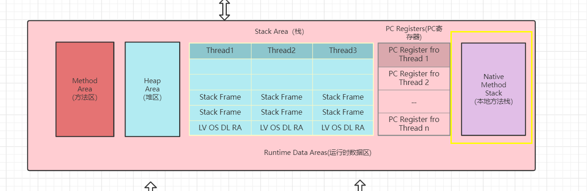

###  Java - 底层建筑 - JVM - 第七篇 - 本地方法栈

####  本地方法栈 （Native Method Stack）

- **Java虚拟机用于管理Java方法的调用，而本地方法栈用户管理本地方法的调用**
- 本地方法栈，也是线程私有的
- 允许被实现固定或者是可拓展的内存大小（在内存溢出方面是相同的）
  - 如果线程请求分配的栈容量超过本地方法栈的最大容量，Java虚拟机竟会抛出一个 StackOverflowError异常
  - 如果本地方法可以动态拓展，那么在拓展到无法申请到足够的内存的时候或者在创建新的线程没有足够的内存的时候，就会抛出 OutOfMemaryError异常
  - 本地方法是使用C语言实现的
  - 它的具体做法是Native Method Stack 中登记 native 方法。在Execution Engine 执行的时候加载本地方法库

#### 本地方法的执行流程

- **当某个线程调用一个本地方法的时候，然就进入了以恶个全新的并且不再受虚拟机限制的世界，他和虚拟机由相同的权限**
- **并不是所有的JVM都支持本地方法，因为Java虚拟机规范并没有明确要求本地方法栈的使用语言、具体实现方式、数据结构等**，如果JVM产品不打算支持native方法，也可以无需实现本地方法栈
- 在Hotspot JVM中 直接将本地方法栈和虚拟机栈合二为一

