###  Java - 底层建筑 - JVM - 第五篇 - 虚拟机栈

####  虚拟机栈出现的背景

- 由于跨平台的设计，Java指令都是根据栈来设计的。不同平台的CPU架构不同，所以不能设计为基于寄存器的
- **优点是跨平台，指令集少，编译器容易实现，确定是性能下降，实现同样的功能需要更多的指令**

#### 内存中的栈和堆

- **栈是运行时的单位，而堆是存储的单位**
- 即：栈是解决程序的运行问题，即程序如何执行，或者说如何处理数据。堆解决的问题是数据存储的问题。即数据怎么放，放在哪儿

#### 虚拟机栈的基本内容

- Java虚拟机栈是什么？
  - Java虚拟机栈（Java Virtual Machine Stack），早期也叫Java栈，
  - 每个线程在创建的时候都会创建一个虚拟机栈，其内部保存的一个个栈帧（Stack Frame）对应的一次次的方法调用
  - 是线程私有的
- 生命周期
  - 生命周期和线程一致
- 作用
  - 主管Java程序的运行，它保存方法的局部变量（8种基本数据类型、对象的引用地址）、部分结果。并参与方法的调用和返回。

####  栈的优点

- 栈式一种快速有效的分配存储的方式，访问速度仅次于程序计数器
- JVM直接对Java栈的操作只有2个
  - 每个方法执行，伴随着进栈（入栈、出栈）
  - 执行结束后的出栈工作
- 对于栈来说不存在垃圾回收问题
  - 无GC 有OOM

####  栈中可能出现的异常

- Java虚拟机规范允许

  Java栈的大小式动态的或者式固定不变的

  - 如果采用固定大小的Java虚拟机栈，那每一个线程的Java虚拟机栈容量可以在线程创建的时候独立选定，如果请求超过虚拟机栈的最大容量，Java虚拟机将会抛出 **StackOverflowError** 异常
  - 如果Java虚拟机栈可以动态扩展，并且在尝试扩展的时候无法申请到足够的内存，或者在创建新的线程的时候，没有足够的内存去创建虚拟机栈。那么Java虚拟机将会抛出 **OutOfMemoryError** 异常

```java
public class StackErrorTest {
    public static void main(String[] args) {
        main(args);//Exception in thread "main" java.lang.StackOverflowError
    }
}
```

####  设置栈内存的大小

> 栈内存大小：-Xss 以字节为单位 ，单位是可以调节的

####  栈中存储什么

- 每个线程都有自己的栈，栈中的数据都是以**栈帧（Stack Frame）**的格式存在
- 在这个线程上正在执行的每个方法都各自对应一个栈帧（Stack Frame）
- 栈帧式一个内存区块，是一个数据集，维系着方法执行过程中的各种数据信息

####  栈运行的原理

- JVM直接对Java栈的操作只有两个，就是对栈帧的 **压栈** 和 **出栈**，**遵循 先进后出/后进先出 原则**
- 在一条活动的线程中，一个时间点上，只会有一个活动的栈帧。即只有当前正在执行的方法的栈帧（栈顶栈帧）是有效的，这个栈帧被称为 **当前栈帧 （Current Frame）**，与当前栈帧相对应的方法就是**当前方法（Current Method）**，定义这个方法的类就是 **当前类（Current Class）**
- 执行引擎运行所有的字节码指令只针对当前栈帧进行操作
- 如果在该方法中调用了其他方法，对应的新的栈帧会被创建出来，放在栈的顶端，成为新的当前栈帧
- **实例代码**

```java
public class StackFrameTest {
    public static void main(String[] args) {
        StackFrameTest stackFrameTest = new StackFrameTest();
        stackFrameTest.methodA();
    }
    public void methodA(){
        System.out.println("methodA开始执行");
        methodB();
        System.out.println("methodA结束执行");
    }

    private int methodB() {
        System.out.println("methodB开始执行");
        int i = 10;
        int n = (int)methodC();
        System.out.println("methodB即将结束执行");
        return i+n;
    }

    private double methodC() {
        System.out.println("methodC开始执行");
        double j = 20.0;
        System.out.println("methodC即将结束执行");
        return j;
    }
}
```

```java
methodA开始执行
methodB开始执行
methodC开始执行
methodC即将结束执行
methodB即将结束执行
methodA结束执行
```

- 不同的线程中所包含的栈帧是不允许存在相互引用的，即不可能在一个栈帧之中引用另外一个线程的栈帧
- 如果当前方法调用了其他的方法，方法返回之际，当前栈帧会传回次方法的执行结果给前一个栈帧，接着虚拟机会丢弃当前的栈帧，使得前一个栈帧重新成为当前栈帧
- Java方法有两种返回函数的方式，**一种是正常的函数返回，使用return指令，另外一种是抛出异常，不管使用那种方式，都会导致栈帧被弹出**

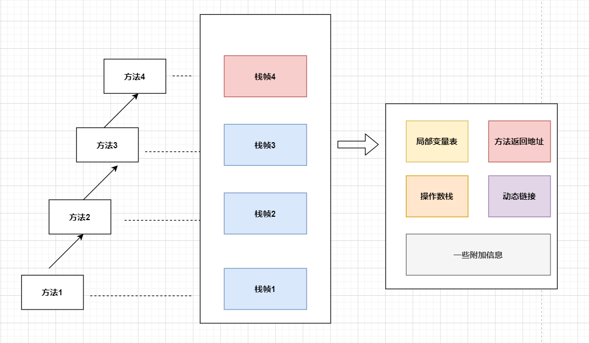

#### 栈帧的内部结构

- **局部变量表（Local Variables）**
- **操作数栈（Operand Stack）（或表达式栈）**
- 动态链接（Dynamic Linking）（或指向运行时常量池的方法引用）
- 方法返回地址（Return Address）（或方法正常退出或者异常退出的定义）
- 一些附加信息

####  局部变量表（Local Variables）

- 局部变量表也被称为局部变量数组或本地变量表

- **定义一个数字数组，主要用于存储方法参数和定义在方法体内的局部变量，**这些数据类型包括各类型的基本数据类型、对象引用（reference），以及returnAddress类型

- 由于局部变量表是建立在线程的栈上，是线程的私有数据。因此**不存在数据不安全的问题**

- **局部变量表所需的容量大小是编译器确定下来的**，并保存在方法的Code属性的maximum local variables数据数据项中，在方法运行期间是不会改变局部变量表的大小的

- **方法嵌套调用的次数由栈的大小决定，**一般来说，**栈越大，方法嵌套调用次数越多。**而对一个函数而言，它的参数和局部变量越多，使得局部变量表膨胀，它的栈帧就越大，一满足方法调用所需传递的信息增加的需求。进而函数调用就会占用更多的栈空间，而导致其嵌套调用的次数就会减少

- **局部变量表中的变量只在当前方法中调用有效**，在方法执行的时候，虚拟机通过使用局部变量表完成参数值到参数列表的传递过程。**当方法调用结束的时候，随着方法栈帧的销毁，局部变量表也会随之销毁。**

- #####  字节码中方法内部结构的刨析

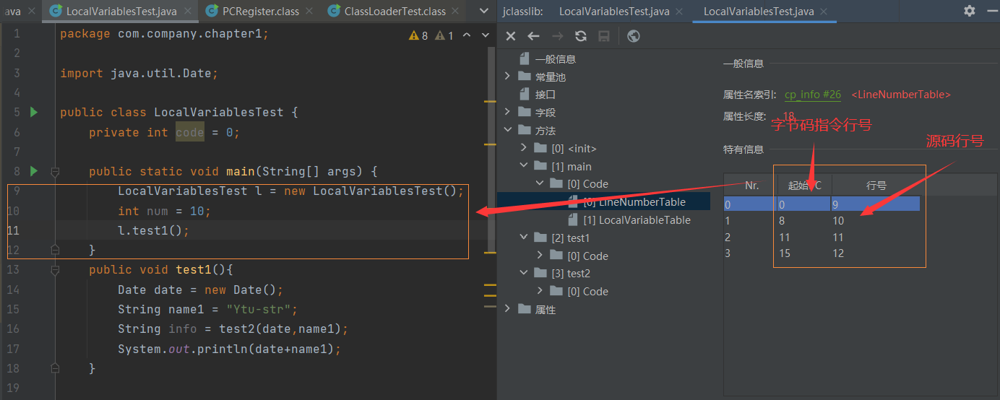

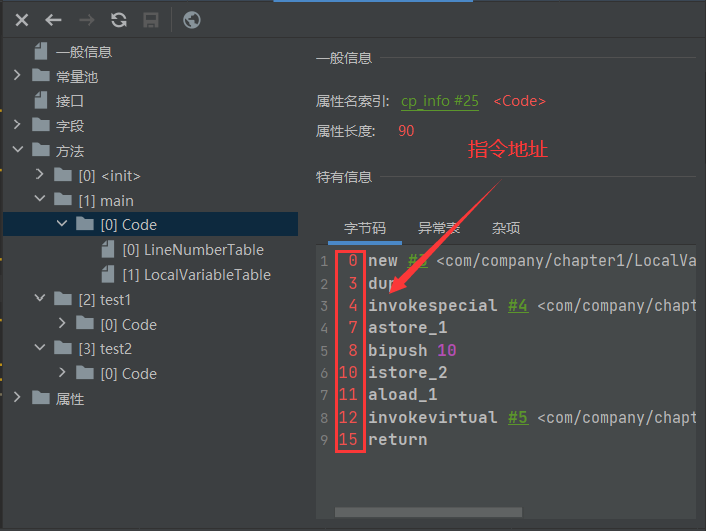

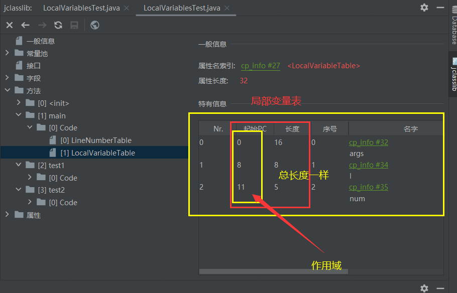

#####  关于Slot的理解

- 参数值的存放总是在局部变量数组的index0开始，到数组长度 -1 的索引结束
- 局部变量表。最基本的存储单元是Slot（变量槽）
- 局部变量表中存放编译器可知的各种基本数据类型（8种），引用类型（reference），returnAdderss类型的变量
- 在局部变量表种。**32位以内的类型只占用一个Slot（包括returnAddress类型），64位的类型（long和double）占用2个Slot**
  - byte、short、char在存储之前被转换为int，boolean也被转为int，0代表false，非0代表true
  - long和double则占据两个Slot
- JVM会为局部变量表中的每一个Solt都分配一个访问索引，通过这个索引即可成功访问到局部变量表中指定的局部变量值
- 当一个实例方法被调用的时候，它的方法参数和方法体内部定义的局部变量将会 **按照顺序被复制** 到局部变量表中的每一个Slot上
- **如果需要访问局部变量表中的一个64bit的局部变量只值的时候，只需要使用前一个索引即可**，（比如：访问long和double类型的变量）
- 如果当前帧是由构造方法或者实例方法创建的，那么 **该对象引用this将会存放在index为0的Slot处**，其余的参数按照参数表顺序继续排列
  - 现在我们就可解释为什么静态方法中无法使用this调用
  - 因为this变量不存在与当前方法的局部变量表中

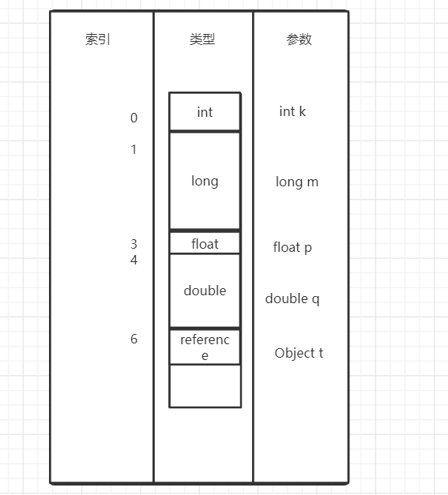

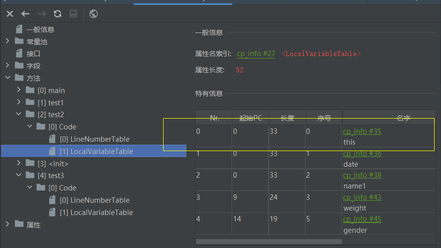

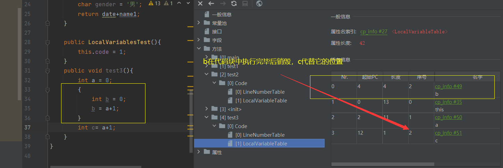

**Slot的重复利用**

- **栈帧中的局部变量表中的槽位是可以重用的，\**如果一个局部变量过了其作用域，那么在其他作用域只会申明的新的局部变量就很有可能会复用过期局部变量的槽位，从而\**达到节省资源的目的**

#####  静态变量与局部变量的对比

- 变量的分类
  - 数据类型：基本数据类型、引用数据类型
    - 在类中的位置：·
    - 成员变量：在使用的时候是有默认初始化值
      - 被static修饰的：类变量 - linking的prepare阶段 - 给类变量默认赋值 -> initial ，给类变量显示赋值 （静态代码块中）
      - 没有被static修饰的：实例变量 - 随着对象的创建，会在堆空间进行分配实例变量空间，并进行默认赋值
    - 局部变量：没有默认初始化值，在使用之前必须初始化

##### 补充说明

- 在栈帧中，与性能调优关系最密切的就是前面提到的局部变量表，在方法执行时，虚拟机使用局部变量表完成方法的传递。
- **局部变量表中的变量也是重要的垃圾回收根节点，只要被局部变量表中直接或者间接引用的对象都不会被回收**

#### 操作数栈

<!--栈可以使用**数组**或链表来实现-->

- 每一个独立的栈帧中除了包含局部变量表意外，还包含一个 **后进先出**（Last-In-First-Out）的操作数栈。也可以称之为**表达式栈**，（Expression Stack）
- 操作数栈，在方法执行的过程中，根据字节码指令，往栈中写入数据或者提取数据，即入栈（push）/出栈（pop）
  - 某些字节码指令将值压入操作数栈，其余的字节码指令将操作数取出栈，使用它们后再把结果压入栈
  - 比如：执行复制、交换、求和等操作

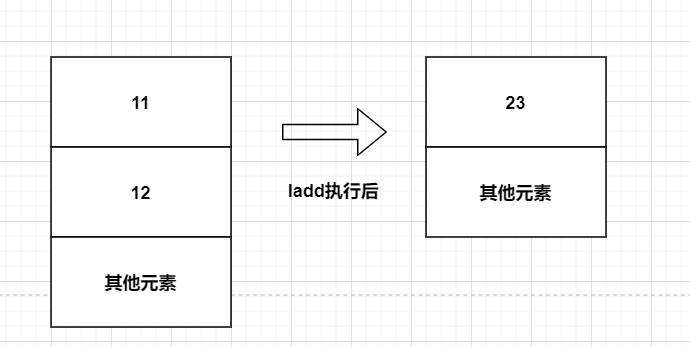

- **如果被调用的方法带有返回值的话，其返回值将会被压入当前栈帧的操作数栈中，**并更新PC寄存器的下一条需要执行的字节码指令
- 操作数栈中元素的数据类型必须与字节码指令的序列严格匹配，这由编译器再编译期间进行验证，同时在类加载中的类检验阶段的数据流分析阶段要再次验证
- 我们说的Java虚拟机的**解释引擎时基于栈的执行引擎**，其中的栈指的就是操作数栈
- 操作数栈，**主要用来保存计算过程中的中间结果，同时作为计算过程中变量的临时存储空间**
- 操作数栈就是JVM执行引擎的一个工作区，当一个方法刚开始执行的时候，一个新栈帧也随之被创建出来，**这个方法的操作数栈时空的**
- 每一个操作数栈都会拥有一个明确的栈深度用于存储数值，其所需的最大深度在编译器就定义好了，保存在方法的Code属性中，为max_stack的值
- 栈中的任何一个元素都可以是任意的Java数据类型
  - 32bit的类型占用一个栈单位深度
  - 62bit的类型占用两个栈单位深度
- 操作数栈 **并发采用访问索引的方式来进行数据访问的**，而是只能通过标准的入栈（push）和出栈（pop）操作来完成一次数据访问

```java
public class OperandStackTest {

    public void testAddOperand(){
        byte i = 15;
        int j = 8;
        int k = i + j;
    }
}
```

```java
  public void testAddOperand();
    descriptor: ()V
    flags: ACC_PUBLIC
    Code:
      stack=2, locals=4, args_size=1
         0: bipush        15
         2: istore_1
         3: bipush        8
         5: istore_2
         6: iload_1
         7: iload_2
         8: iadd
         9: istore_3
        10: return
      LineNumberTable:
        line 6: 0
        line 7: 3
        line 8: 6
        line 9: 10
      LocalVariableTable:
        Start  Length  Slot  Name   Signature
            0      11     0  this   Lcom/company/chapter1/OperandStackTest;
            3       8     1     i   B
            6       5     2     j   I
           10       1     3     k   I
}

```

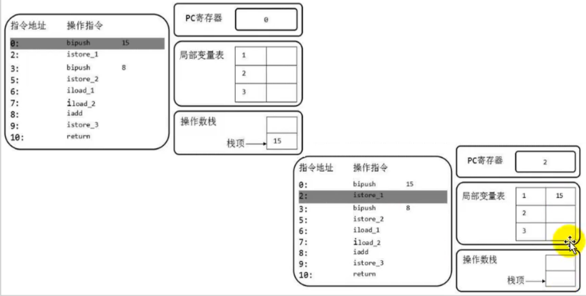

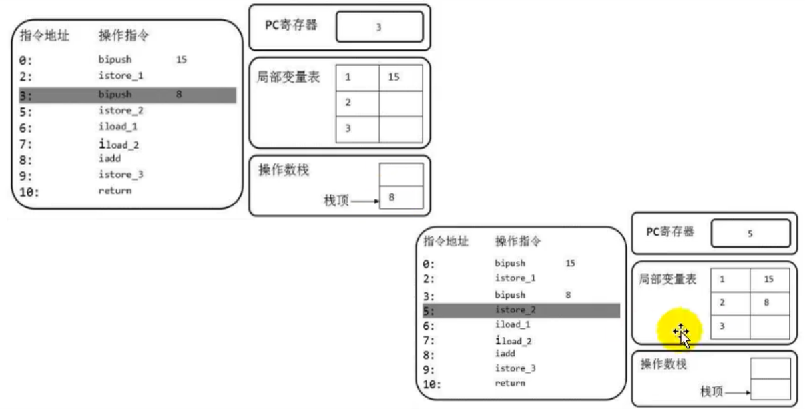

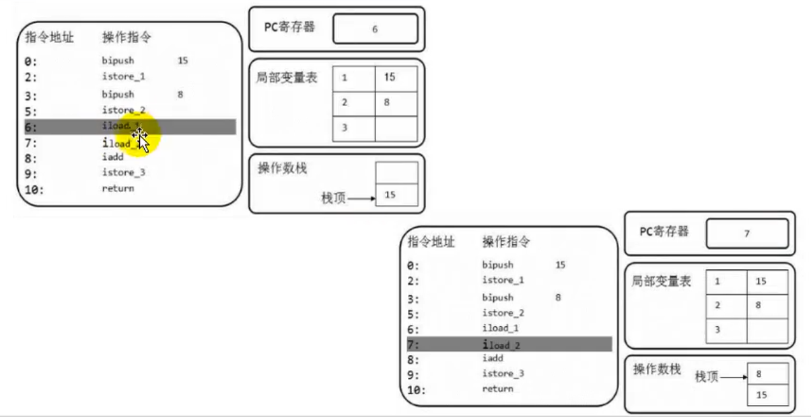

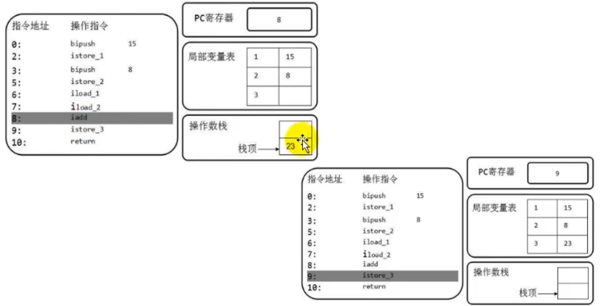

##### 面试题常见的 i++和++i问题

**放在字节码解释**

```java
 public void add(){
        //第一类问题
        int i1 = 10;
        i1++;

        int i2 = 10;
        ++i2;
 }
```

```
 0 bipush 10
 2 istore_1
 3 iinc 1 by 1
 6 bipush 10
 8 istore_2
 9 iinc 2 by 1
12 bipush 10
```

####  栈顶缓存技术

- 前面提到过，基于栈式架构的虚拟机所使用的零地址指令更加紧凑，但是完成一项操作的时候必然需要使用更多的入栈的出栈指令，这同时也就意味着需要将更多的指令分派（instruction dispatch）次数和内存读/写次数
- 由于操作数是存在内存中的，因此频繁的执行内存读/写操作必然会影响执行速度。为了解决这个问题，Hotspot JVM的设计者们提供了栈顶缓存技术（ToS Top-of-Stack Cashing）**将栈顶元素全部缓存在物理的CPU的寄存器中，以此降低对内存的读/写次数。提升执行引擎的执行效率**

#### 动态链接（或指向运行时常量池的方法引用）

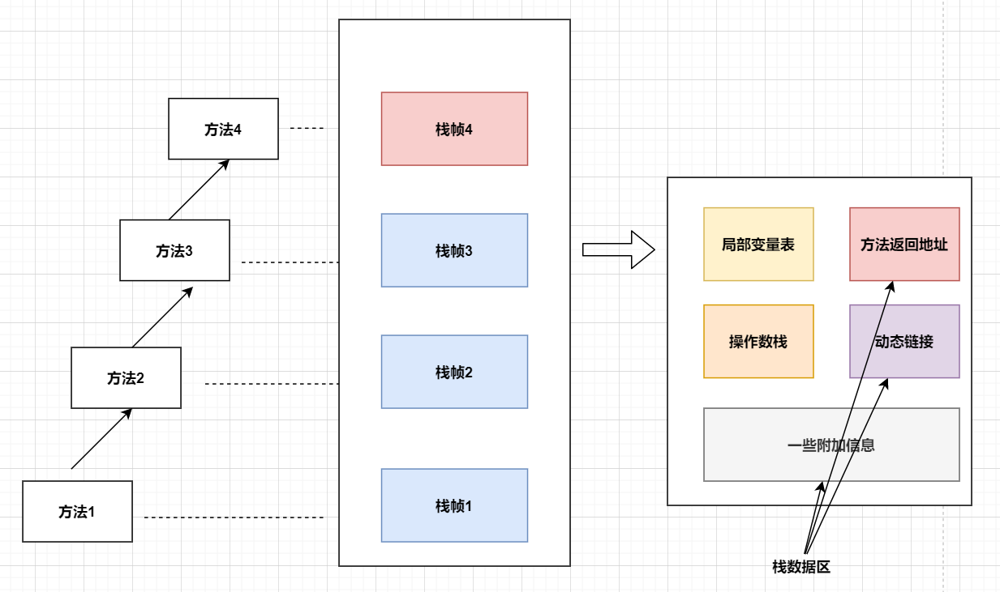

- 每一个栈帧内部都包含一个指向 **运行时常量池** **该栈帧所属方法的引用**，包含这个引用的目的即使为了支持当前方法的代码能够实现 **动态链接（Dynamic Linking） ** 比如：involvedynamic指令
- 在Java源文件被编译到字节码文件的时候，所有的变量和方法引用都作为符号引用）（Symbolic Reference）保存在class文件的常量池中。比如：描述一个方法调用了另外的其他方法的时候。就是通过常量池中指向方法的符号引用来表示的，那么 **动态链接的作用就是将这些符号引用转换为调用方法的直接引用**

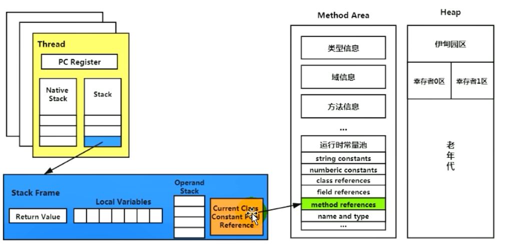

**为什么需要常量池呢？**

- 为了提供一些符号和常量，便于指令的识别。

####  方法的调用

- 在JVM中，将符号引用转换为调用方法的直接引用与方法的绑定机制相关
- 静态链接
  - 当一个字节码文件被装载到JVM内部的时候，如果被调用的 **目标方法在编译器可知**，且在运行期保持不变时，这种情况下将调用方法的符号引用转换为直接引用的过程叫做静态链接
- 动态链接
  - 如果 **被调用的方法在编译期间无法被确定下来**，也就是说，只能够在程序运行期将调用方法的符号引用转换为直接引用，由于这种引用转换过程具备动态性，因此也就称之为动态链接。

- 对应的方法绑定机制为：早期绑定（Early Binding）和晚期绑定（Late Binding） **绑定一个字段、方法或者类在符号引用替换为直接引用的过程，仅仅发生一次**
- 早期绑定
  - 早期绑定就是指被调用的 **目标方法如果在编译期间可知，且运行期保持不变时**，即可将这个方法与所属的类型进行绑定，这样一来，由于明确了被调用的目标方法究竟是哪一个，因此可以使用静态链接的方式将符号引用转为直接引用
- 晚期绑定
  - **如果被调用的方法在编译期无法被确定下来，只能够在程序运行期间根据实际的类型绑定相关的方法**，这种绑定叫做晚期绑定。

- 随着高级语言的横空出世，类似Java一样的基于面向对象的编程语言如今越来越多，尽管这类编程语言在语法风格上存在一定的差别，但是彼此之间始终保持一个共性，那就是都支持封装、继承、多态等面向对象的特征，既然**这一类的编程语言具备多态特性，那么自然也就具备早期绑定和晚期绑定两种绑定方式**
- Java中任意一个普通方法都具备虚函数的特征，如果某个方法不想用于虚函数的特征的时候，可以使用final关键字来标记

**虚方法与非虚方法**

- 非虚方法
  - 如果方法在编译期就确定了具体的调用版本，这个版本在运行时候是不可变的，这样的方法叫做**非虚方法**
  - 静态方法、私有方法、final方法、实例构造器、父类方法都是非虚方法
- 虚方法
  - 除了非虚方法都是虚方法

**虚拟机中提供的方法调用的指令**

- 普通调用指令
  - **invokestatic：调用静态方法，解析阶段确定唯一方法版本**
  - **invokespecial：调用方法、私有以及父类方法、解析阶段确定唯一方法版本**
  - invokevirtual：调用所有的虚方法
  - invokeinterface：调用接口方法
- 动态调用指令
  - invokedynamic：动态解析出需要调用的方法，然后执行
- 前四条指令固化在虚拟机内部，方法的执行调用不可人为干涉，而invokedynamic指令则支持用户确定方法版本，其中 **invokestatic指令和invokespecial指令调用的方法称为非虚方法。其余的（final修饰的除外）称为虚方法**

**关于involvedynamic指令**

- JVM字节码指令集一直比较稳定，一直到Java7中才增加了一个invokedynamic指令，这是**Java为了实现[动态类型语言]支持而做的一种表达方式**
- 但是在Java7中并没有提供直接生成involvedynamic指令的方法，需要借助ASM这种底层字节码工具来生成involvedynamic指令。**直到Java8的Lambda表达式的出现，involvedynamic指令才有了直接的生成方式**
- Java7中增加的动态语言类型支持的本质是对Java虚拟机规范的修改，而不是对Java语言规则的修改，这里比较复杂，最直接的受益者就是运行在Java平台的动态语言的编译器。

####  动态类型语言和静态类型语言

- 动态类型语言的静态类型语言的区别就是对类型的检查是在编译期还是在运行期，满足前者就是静态类型语言，满足后者就是动态类型语言。
- **静态类型语言就是判断变量自身的类型信息；动态类型语言是判断变量值的信息，变量没有类型信息，变量值才有类型信息**

####  方法重写的本质

- 找到操作数栈顶的第一个元素随执行的对象的实际类型，记作 C
- 如果在类型 C 中找到与常量中的描述符合简单名称都相符的方法，则进行访问权限校验，如果通过则返回这个方法的直接引用，查找过程结束；如果不通过，就返回 java.lang.IllegalAccessError异常
- 否则，按照继承关系从下往上一依此对 C 的各个父类进行第2步的搜索和验证过程
- 如果始终没有找到，就抛出java.lang.AbstractMethodError异常
- java.lang.IllegalAccessError异常
  - 程序试图访问一个属性或者调用一个方法的时候，这个属性或者方法没有权限进行访问。

####  虚方法表

- 在面向对象的编程中，会很繁琐的使用到动态分派，如果每次动态分派多的过程中都要重新在类的方法元数据中搜索合适的目标的话，就可能影响到执行效率。因此，**为了提高性能**，JVM采用在类的方法区建立一个虚方法表**（virtual method table）（非虚方法不会出现在表中）来实现，使用索引表来代替查找**
- 每个类都有一个虚方法表，表中存放着各个方法的实际入口
- 虚方法表在什么时候会被创建？
  - 在类加载的链接阶段被创建并开始初始化，类的变量初始值准备完成之后，JVM会把该类的方法表 也初始化完毕

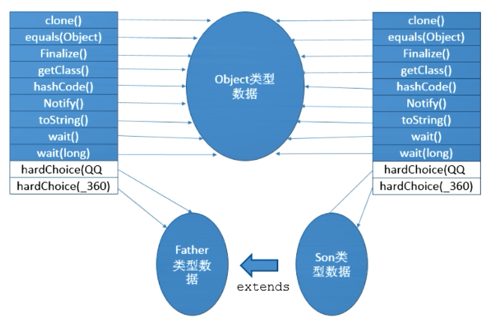

####  方法返回地址

- 存放着调用该方法的PC寄存器的值
- 一个方法的结束，有两种方式
  - 正常处理完成
  - 出现未处理的异常，非正常退出
- 无论通过那种方式退出，在方法退出后都返回到该方法被调用的位置，方法正常退出的时候，**调用者的PC寄存器的值作为返回地址，即调用该方法的指令的下一条指令的地址**。而通过异常退出的，返回的地址是要通过异常表来确定，栈帧中一般不会保持这部分的信息。
- 本质上，方法的退出即使当前栈帧出栈的过程。此时，需要恢复上层方法的局部变量表、操作数栈、讲返回值压入调用者栈帧的操作数栈、设置PC寄存器值等，让调用者方法继续执行下去
- **正常完成出口和异常完成出口的区别在于：通过异常出口完成退出的不会给它的上层调用者产生任何的返回值**
- 当一个方法开始执行之后，只有两种方式可以退出这个方法
  - 执行引擎遇到任何一个方法返回的字节码指令（return），会有返回值传递给上层的方法调用者，简称 **正常完成出口**
- 一个方法在正常调用完成之后究竟需要使用哪一个返回指令还需要根据方法返回值的实际数据类型而定
- 在字节码指令中，返回指令包含 ireturn （返回值是boolean、byte、char、short和int类型时使用），lreturn、freturn、dreturn、areturn，另外还有一个return指令共声明void方法、实例化初始方法、类和接口的初始方法使用
- 在方法执行的过程中遇到了异常（Exception），并且这个异常没有在方法内进行处理，也就是只要在本地方法异常表没有搜索到匹配的异常处理器，就会导致方法退出，检查 **异常完成出口**
- 方法执行过程中抛出异常时的异常处理，存储在一个异常处理表。方便在发生异常的时候找到处理异常的代码

```java
public class JVMExceptionTest {
    public static void main(String[] args) {
        try {
            test();
        }catch (NoSuchMethodError e){

        }catch (ClassFormatException e){

        }catch (Exception e){

        }
    }
    public static void test(){

    }
}
```

```java
 Exception table:
         from    to  target type
             0     3     6   Class java/lang/NoSuchMethodError
             0     3    10   Class com/sun/org/apache/bcel/internal/classfile/ClassFormatException
             0     3    14   Class java/lang/Exception

```

####  一些附加信息

- 栈帧中还允许携带与Java虚拟机实现相关的一些附加信息，例如：对程序调试支持的信息

####  栈的相关面试题

- 举例栈溢出的情况？
  - 递归调用深度太深 （StackOverflowError）
  - 通过 -Xss 设设置大小
  - 整个内存不足了就会出现 OOM问题
- 调整栈的大小，就能保证不出现溢出吗？
  - 不能，只是可以延迟栈溢出的时间
  - 有可能可以解决栈内存溢出问题
- 分配的栈内存越大越好吗？
  - 并不是，内存空间是有限的，栈内存变大了，其他的空间就少了
- 垃圾回收是否会设计到虚拟机栈？
  - 不会的 会涉及到局部变量
- 方法中定义的局部变量是否线程安全？
  - 具体问题具体分析 如下

```java
/**
 * 方法中定义的局部变量是否线程安全
 *
 * 何为线程安全：如果只有一个线程才可以操作此数据，则必是线程安全的。
 *             如果有多个线程操作此数据，则此数据是共享数据。如果不考虑同步机制，会存在线程安全问题。
 */
public class StringBuilderTest {
    //s1的声明方式是线程安全的
    public static void method1(){
        //StringBuilder线程不安全
        StringBuilder s1 = new StringBuilder();
        s1.append("a");
        s1.append("b");
    }
    //stringBuilder的操作过程是线程不安全的。
    public static void method2(StringBuilder stringBuilder){
        stringBuilder.append("a");
        stringBuilder.append("b");
    }
    //s2的操作是线程不安全的
    public static StringBuilder method3(){
        StringBuilder s2 = new StringBuilder();
        s2.append("a");
        s2.append("b");
        return s2;
    }
    /**
     * s3的操作是线程安全的 ，因为s3在内部消亡了，toString重新new了一个String 返回值可能被其他线程调用，所以不安全
     *   @Override
     *     public String toString() {
     *         return new String(value, 0, count);
     *     }
     */
    public static String method4() {
        StringBuilder s3 = new StringBuilder();
        s3.append("a");
        s3.append("b");
        return s3.toString();
    }


    public static void main(String[] args) {
        StringBuilder s = new StringBuilder();

        new Thread(()->{
           s.append("a");
           s.append("b");
        }).start();

        method2(s);
    }
}
```

