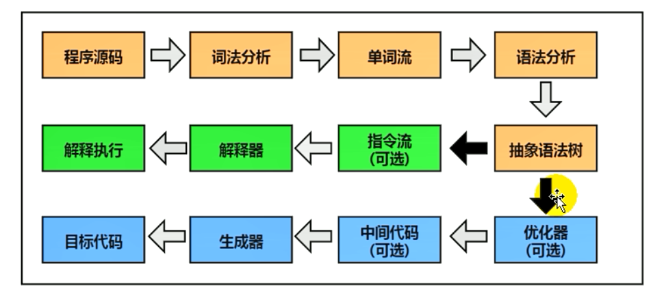
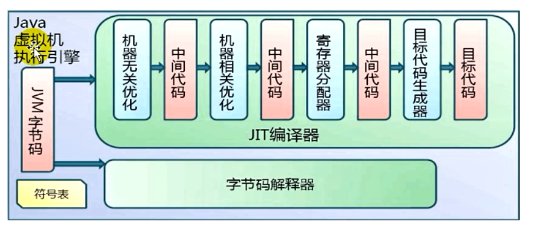

### Java - 底层建筑 - JVM - 第十二篇 - 执行引擎

#### 执行引擎概述

- 执行引擎是Java虚拟机核心组件之一
- “虚拟机”是一个相对于“物理机”的概念，这两种机器都有代码执行的能力，其区别就是物理机的执行引擎是建立在处理器、缓存、指令集和操作系统层面上的，而**虚拟机的执行引擎则是由软件自行实现的**，因此可以不受物理条件的制约指令集和执行引擎的结构体系，**能够执行哪些不被硬件直接支持的指令集格式**。
- JVM的主要任务是负责 **装载字节码到其内部**，但是字节码并不能够直接运行在操作系统之上，因为字节码指令并非等价于本地机器指令，它内部包含的仅仅只是一些能够被JVM所识别的字节码指令、符号表、以及其他辅助信息
- 那么如果想要一个Java程序运行起来，执行引擎（Execution Engine）的任务就是 **将字节码指令解释/编译为对应平台的本地机器指令才可以**，简单来说JVM的执行引擎充当了高级语言翻译为机器语言的译者

#### 执行引擎的工作流程

- 执行引擎在执行的过程中究竟需要执行什么样的字节码指令完全依赖于PC寄存器
- 每当执行完一项指令操作之后，PC寄存器就会更新下一条需要被执行的指令的地址
- 当然方法在执行的过程中，执行引擎可能会通过存储在局部变量表中的对象引用准确定位到存储在Java堆区中的对象的实例信息，以及通过对象头中的元数据指针定位到目标对象的类型信息
- 从外观上来看，所有的Java虚拟机的执行引擎的输入、输出都是一致的：输入的是字节码二进制流，处理过程是字节码解析执行的等效流程，输出的是执行结果

#### Java代码编译和执行的过程

- 大部分的程序代码转换成物理机的目标代码或者虚拟机能执行的指令集之前，都需要经过上图的各个步骤。

- 问题：什么是解释器（Interpreter），什么是JIT编译器
  - 解释器：当Java虚拟机启动的时候会根据预定义的规范 **对字节码采用逐行解释的方式执行**，将每条字节码文件中的内容“翻译”为对应平台的本地机器指令执行
  - JIT（Just In Time Compiler）编译器：就是虚拟机将源代码直接编译成和本地机器平台相关的机器语言
- 问题：为什么说Java是半编译半解释型语言
  - JDK1.0时代，将Java语言定义为“解释执行”还是比较准确的，再后来Java也发展出可以直接生成本地代码的编译器
  - 现在JVM在执行Java源码的时候，通常都会将解释执行和编译执行二者结合起来进行。

#### 机器码指令、汇编、高级语言的理解与执行过程

#####  机器码

- 各种用二进制编码的方式表示的指令，叫做**机器指令码**。开始，人们就用它编写程序，这就是机器语言
- 机器语言虽然能够被计算机理解和接受，但是和人们的语言差别太大，不容易被人们理解和记忆，并且用它编程容易出差错
- 用它编写的程序一经输入到计算机，CPU直接读取执行，因此和其他语言编写的程序相比，执行速度最快
- 机器指令与CPU紧密相关，所以不同种类的CPU所对应的机器指令也就不同

##### 指令

- 由于机器码是由0和1组成的二进制序列，可读性实在太差，于是人们发明了指令
- 指令就是把机器码中特定的0和1序列，简化成相应的指令（一般使用英文简写，如mov，inc等），可读性稍好
- 由于不同的硬件平台，执行同一个操作，对应的机器码可能不同，所以不同的硬件平台的同一种指令（如mov）对应的机器码也不同

##### 指令集

- 不同的硬件平台，各自支持的指令，是有差别的。因此每个平台所支持的指令，称之为对应平台的指令集
- 常见的
  - x86指令集，对应的是x86架构的平台
  - ARM指令集，对应的是ARM架构的平台

##### 汇编语言

- 由于机器指令的可读性还是太差，于是人们有发明了汇编语言
- 在汇编语言中，用**助记符（Mnemonics）\**代替\**机器指令的操作码**，用**地址符号（Symbol）或者标号（Label）\**代替\**指令操作数的地址**
- 在不同的硬件平台，汇编语言对应着不同的机器语言指令集，通过汇编过程转称机器指令
  - 由于计算机只认识指令码，所以用**汇编语言编写的程序还必须翻译成机器指令码**。计算机才能识别和执行

##### 高级语言

- 为了使得计算机用户编程序更容易一些，后来就出现了各种高级计算机语言，高级语言比机器语言、汇编语言**更接近人的语言**
- 当计算机执行高级语言编写程序的时候，**仍然需要将程序解释和编译成机器的指令码**。完成这个过程的程序就叫做解释程序或者编译程序

#####  字节码

- 字节码是一种中间状态（中间码）的二进制代码（文件），它比机器码更抽象，需要直译器转译之后才能成为机器码
- 字节码主要是为了实现特定软件运行和软件环境、**与硬件环境无关**
- 字节码的实现方式是通过编译器和虚拟机器，编译器将源码编译成字节码，特定平台上的虚拟机器将字节码转译为可以执行的命令
  - 字节码的典型应用就是 ByteCode

**编译过程又可以分为两个阶段：编译和汇编**

- 编译过程：是读取源程序（字符流），对之进行词法和语法的分析，将高级语言指令转换为功能等效的汇编代码
- 汇编过程：实际上指把汇编语言代码翻译成目标机器指令的过程

#### 解释器

- JVM的设计者们的初衷仅仅只是单纯的**为了满足Java程序的跨平台性**，因此避免采用静态编译的方式直接生成本地机器指令，从而诞生了实现解释器在运行时采用逐行解释字节码执行程序的想法

##### 解释器工作机制（或工作任务）

- 解释器真正意义上所承担的角色就是一个运行时“翻译者”，将字节码文件中的内容“翻译”为对应平台的本地机器指令执行
- 当一条字节码指令被解释执行完成之后，接着再根据PC寄存器中记录的下一条需要被执行的字节码指令执行解释操作

##### 解释器的分类

- 在Java发展历史里，一共有两套解释执行器，即古老的**字节码解释器**、现在普遍使用的是**模板解释器**
- 字节码解释器在执行时通过**纯软件代码**，模板字节码的执行，效率非常地下
- 而模板解释器将**每一条字节码和一个模板函数相关联**，模板函数中直接产生这条字节码执行的机器码。从而很大程度上提高了解释器的性能
  - 在Hotspot VM中，解释器主要由Interpreter模块和Code模块构成
    - Interpreter模块：实现了解释器的核心功能
    - Code模块：用于管理Hotspot VM 在运行时生成的本地机器指令

##### 现状

- 由于解释器在设计上和实现上非常简单，因此除了 Java之外，其他语言也基于解释器执行。但是今天 **基于解释器执行已经沦落为低效的代名词**
- 为了解决这个问题，JVM平台支持一种即时编译的技术。即时编译的目的是避免函数被解释执行，而是**将整个函数体编译成机器码吗，每次该函数执行的时候，只执行编译后的机器码即可**，这种方式可以使得执行效率大幅度提升

#### JIT编译器

- Hotspot虚拟机是目前市面上高性能虚拟机的代表之一。**它是采用解释器和即时编译器并存的架构**，在其运行的时候，会找到解释器和即时编译器相互合作的节点。各自取长补短。
- 今天，Java的运行性能已经可以和C/C++程序一教高下的地步
- 既然Hotspot VM中已经内置了JIT编译器了，那么为啥还需要再使用解释器来“拖累”程序的执行性能呢？比如JRrockit VM 就不包含解释器，字节码全部依靠即时编译后执行 - 所以它号称最快的虚拟机
- **首先明确**
  - 当程序启动的时候，解释器可以马上发挥作用，省去编译的时间，立即执行，编译器想要发挥作用，把代码编译为本地代码，需要一定的时间。但是编译为本地代码后，执行效率高
  - 所以，JRockit 虚拟机执行性能很高，但是再启动的时候会会花费更多的时间
  - 所以Hotspot虚拟机，都进行使用，当虚拟机启动的时候，解释器首先发生作用，不必等待即时编译器全部编译完再执行，这样可以省去不必要的编译时间。随着时间的推移，越来越多的热点代码被编译为机器指令代码，所以程序执行会越来越快
- **概念解释**
  - Java语言得“编译期”其实是一段“不确定”得操作过程，因为它可能是指一个**前端编译器**（其实也叫 **编译器的前端**）把 .java 文件转换成 .class 文件的过程
  - 也可能是指**后端运行编译器**（JIT编译器 Just In Time Compiler） 把字节码转换为机器码的过程
  - 还可能是使用 **静态提前编译器**（AOT编译器 Ahead Of Time Compiler）直接把 .java 文件编译成本地机器码的过程

####  热点代码以及探测方式

- 当然是否需要启动JIT编译器将字节码直接编译为对应平台的本地机器指令，则需要根据代码被调用 **执行的频率** 而定。这样的被编译为本地代码的字节码，称为**热点代码**，JIT编译器再运行时会针对哪些被频繁调用的“热点代码”做出**深度优化** 将其直接编译为对应平台的本地机器指令，以提升Java程序的执行性能
- **一个被多次调用的方法，或者是一个方法体内部循环次数比较多的循环体都可以称为是热点代码**，因此都可以通过JIT编译器翻译为本地机器指令，由于这种编译方式发生在方法的执行过程中，因此也被称为栈上替换。或者简称为 **OSR（On Stack Replacement）**
- 一个方法**究竟要调用多少次**，或者一个循环体究竟循环多少次，才会达到这个标准？肯定需要一个明确的阈值，JIT才会编译之为本地代码。这里主要依赖 **热点探测功能**
- **目前Hotspot VM 采用热点探测方式是基于计数器的热点探测**
- 采用计数器的热点探测，Hotspot VM 将会为每一个方法都建立2个不同类型的计数器，分别为方法调用计数器，分别为方法调用计数器（Invocation Counter）和回边计数器（Back Edge Counter）
  - 方法回调计数器用于传统统计方法的调用次数
  - 回边计数器则用于统计循环体执行的循环次数

#####  方法调用计数器

- 这个计数器就是用于统计方法被调用的次数，它的默认阈值再 Client 模式下是1500次，再Server下是10000次，超过这个阈值，就会触发JIT编译
- 这个阈值可以通过虚拟机参数 -XX:ComplieThreshold 来设定
- 当一个方法被调用的时候，会先检查该方法是否存在被JIT编译过的版本，如果存在，则优先使用编译后的本地代码来执行，如果不存在已经被编译的版本，则将此方法的调用计数器值加1，然后判断 **方法调用计数器和回边调用计数器之和**是否超过方法调用计数器的阈值，如果超过，就向编译器提交一个该方法的编译请求

**热度衰减**

- 如何不做任何设置，方法调用计数器统计的不是被调用的绝对次数，而是一个相对的执行频率。即 **一段时间之内方法被调用的次数** 当超过 **一定的时间限制**，如果调用的次数不足，就可以将他转交给即时编译器编译，哪这个方法的调用计数器就会减少一半，这个过程就是调用计数器热度的**衰减（Counter Decay）**，而这段时间就称为次方法统计的**半衰周期（Counter Half Life Time）**
- 进行热度衰减的动作，是再虚拟机内部垃圾收集的时候顺便执行的，可以使用虚拟机参数 **-XX:-UseCouinterDecay**关闭
- 可以使用 **-XX:CounterHalfLifeTime** 参数设置半衰周期的时间，单位是秒

##### 回边计数器

- 统计方法中循环 体代码的执行次数，建立回边计数器统计就是为了触发 OSR 编译

####  Hotspot VM 可以设置程序的执行方式

- 缺省情况下 Hotspot 虚拟机使用解释器与编译器并存的架构，开发人员也可以对齐进行调整，**设置为完全采用解释器或者完全采用即时编译器**
- **-Xint**:完全采用解释器模式执行程序
- **-Xcomp**:完全采用即时编译器模式执行程序，如果编译出现问题，解释器会介入
- **-Xmixed**:采用解释器+即时编译器混合模式执行程序

#### Hotspot VM 中JIT分类

- 在Hotspot VM 内嵌两个JIT编译器，分别为 Client / Server Compiler 但是大多数情况下我们称之为 C1编译器和C2编译器，可以设置使用哪一种编译器
- -client 使用c1编译器
  - C1编译器会对字节码进行 **简单和可靠的优化，耗时短** 以达到更快的编译速度
- -server 使用c2 编译器
  - C2进行 **耗时较长的优化，以及激进优化** 但是优化的代码执行效率高

**C1和C2编译器不同的优化策略**

- 在不同的编译器上有不同的优化策略，
- C1编译器有方法内联，去虚拟化、冗余消除
  - 方法内联：将引用的函数代码编译道引用点处，这样就可减少栈帧的生成，减少参数的传递和跳转过程
  - 去虚拟化：对唯一的实现类进行内联
  - 冗余消除：在运行期间会把一些不会执行的代码折叠掉
- C2的优化主要是在全局层面，逃逸分析师优化的基础，基于逃逸分析在C2上有如下几种优化
  - 标量替换：用标量替换聚合变量
  - 栈上分配：对于为逃逸的对象分配对象的在栈而不是在堆
  - 同步消除：清除同步动作，通常指的是synchronized
- **分层编译（Tiered Compiler）策略**
  - 程序解释执行（不开启性能监控）可以触发C1，将字节码编译成机器码，可以进行简单优化，也可加上性能优化，C2编译会根据性能监控信息进行激进优化
  - 不过在Java7版本之后，一旦开发人员在程序中显示指定命令 "-server"时，默认开启，使用c1和c2共同执行

#### Graal编译器与AOT编译器

**Graal编译器**

- 在JDK10之后，Hotspot又加入了一个全新的即时编译器：Graal 编译器
- 编译效果短短几年就追平了C2编译器
- 目前还在实验阶段
  - -XX:+UnlockExperimentalVMOptions -XX:+UseJVMCICompiler去激活才能使用

**AOT编译器**

- JDK9.0 之后加入了AOT编译器（静态提前编译器 Ahead Of Time Compiler）
- JDK9 引入了实验性的 AOT 编译工具 jaotc ，它借助了 Graal 编译器。将所输入的Java类文件转换为机器码，并存放道生成的动态共享库中
- 所谓的AOT编译器 时与即时编译器对立的一个概念，**即时编译器在程序运行的时候**，而**AOT编译器是在程序运行之前**
- 最大好处：可以直接执行，不必等程序预热，减少第一次运行慢的体验
- 缺点：
  - 破坏了 Java”一次编译，到处运行“，因为直接编译之后的文件是固定的，必须为每种系统都编译
  - **降低了Java动态链接的动态性**，加载的代码在编译器期就必须全部已知
  - 还需要继续优化中，最初只支持Linux x64 java base