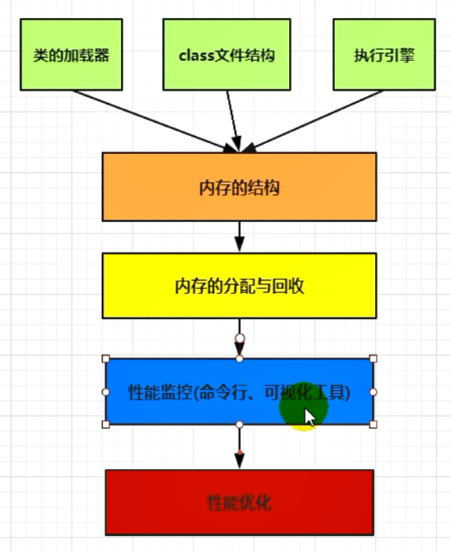
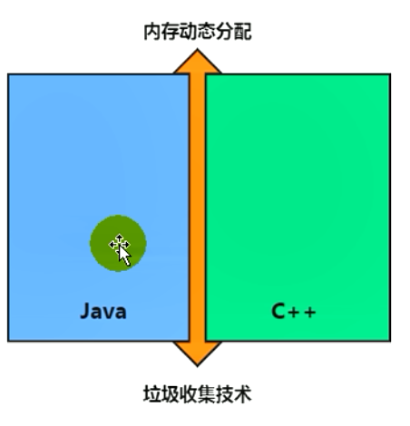

###  Java - 底层建筑 - JVM - 第十四篇- 垃圾回收概述

####  什么是垃圾

​	

- 垃圾收集，不是Java语言的伴生产物。早在1960年，第一门开始使用内存动态分配和垃圾收集技术的Lisp语言诞生
- 关于垃圾收集有三个经典问题
  - 哪些内存需要回收
  - 什么时候回收
  - 如何回收
- 垃圾收集机制是Java的招牌能力。**极大的提高了开发效率**
- **垃圾**
  - 垃圾是指在 **运行程序中没有任何指针指向的对象**，这个对象就是需要被回收的垃圾
- 如果不及时对内存中的垃圾进行清理，那么这些垃圾会一直占用空间，直到程序运行结束，被占用的空间就浪费了，可能会导致内存溢出。

#### 为什么需要GC

- 对于高级语言来说，一个基本认知是如果不进行垃圾回收，**内存迟早都会被消耗完**，因为不断地分配内存空间而不进行回收，就好像不停地生产生活垃圾而从来不打扫一样
- 除了释放没用的对象，垃圾回收也可以清除内存里地记忆碎片。碎片整理将所占用地对内存移动到堆的一端，以便 **JVM 将整理出来的内存分配给新的对象**
- 随着应用程序所应付的业务越来越庞大、复杂，用户越来越多，**没有GC就不能保证应用程序的正常进行**。而经常造成STW的GC又跟不上实际的需求，所以在不断对GC进行优化
- 在早期的C/C++时代，垃圾回收基本上是手动执行的，开发人员可以使用new关键字进行内存申请 ，并使用delete关键字进行内存释放。
- 这种方式可以灵活控制内存释放的时间，但是会给开发人员带来 **频繁申请和释放内存的管理负担**，倘若有一处内存区间由于程序员编码的问题忘记被回收，那么就会产生 **内存泄漏**，垃圾对象永远多无法被清除，随着系统运行时间的不断增长，垃圾对象所耗内存可能持续上升，直到出现了内存溢出并造成 **应用程序崩溃**

#### Java的垃圾回收机制

- **好处**
  - 自动内存管理，无需开发人员手动参与内存的分配与回收，这样**降低内存泄漏和内存溢出的风险**
  - 自动内存管理机制，将程序员从繁重的内存管理中释放出来，可以 **更专心的专注于业务开发**
- **担忧**
  - 对于Java开发人员来讲，自动内存管理就是一个黑匣子。**会严重弱化Java开发人员在程序出现内存溢出是定位问题和解决问题的能力**
  - 此时了解JVM的自动内存分配和内存回收原理就显得非常重要，只有在真正了解JVM是如何自动管理内存的时候，我们才能在遇见OutOfMemoryError的时候，快速的根据错误异常日志定位问题和解决问题
  - 当需要排查各种内存溢出、内存泄漏的问题的时候，当垃圾收集称为系统达到更高并发量的瓶颈的时候，我们就必须针对这些“自动化”的技术 **实施必要的监控和调节**
- 垃圾回收器可以对年轻代回收，也可以对老年代回收，甚至是全堆和方法区的回收
  - 其中，**Java堆是垃圾回收的工作重点**
  - 从次数上来讲
    - 频繁收集Young区
    - 较少收集Old区
    - 基本不动Perm区
