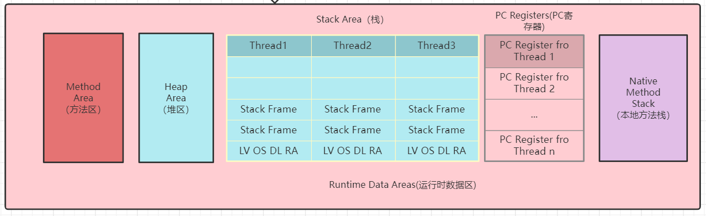
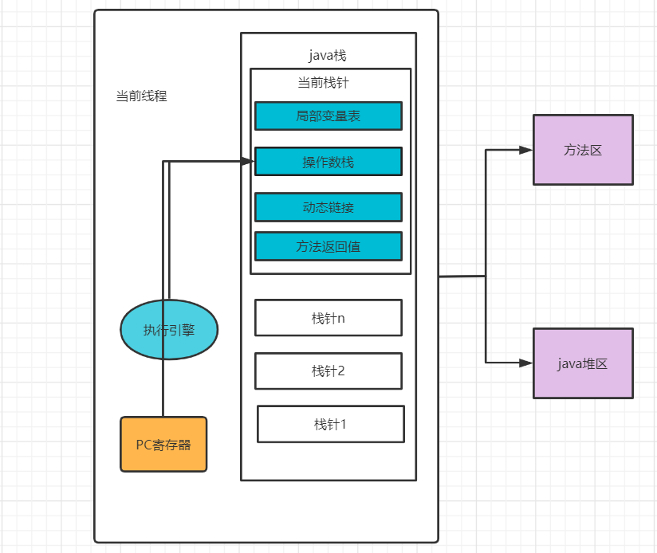
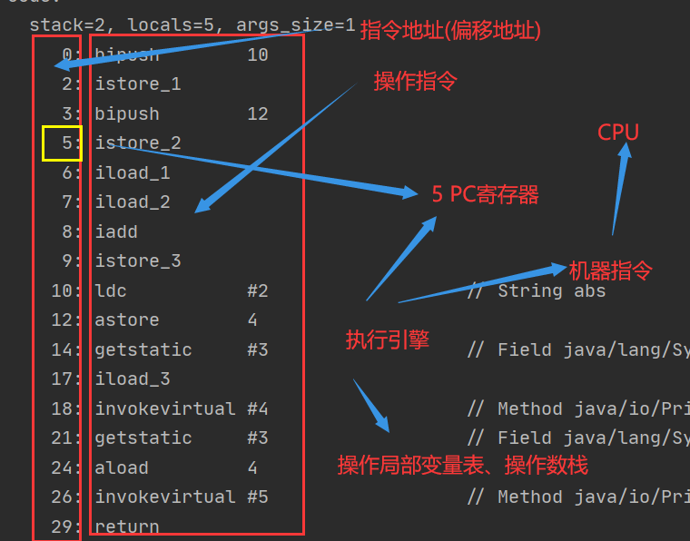

###  Java - 底层建筑 - JVM - 第四篇 - 程序计数器

####  PC Register 介绍



- JVM中的程序计数寄存器（Program Counter Register）中，Register的命名源于CPU的寄存器，寄存器存储指令相关的线程信息。CPU只有把数据装载到寄存器才能够运行
- 这里，并非广义上的所指的物理寄存器，或许将其翻译为PC计数器（或指令计数器）会更加的贴切（也称为程序钩子），并且也不容易引起一些不必要的误会。**JVM中的PC寄存器是对物理PC寄存器的一种抽象模拟**



**作用**

- PC寄存器用来存储指向下一条指令的地址，也即将要执行的指令代码，由执行引擎读取下一条指令。

**介绍**

- 它是一块很小的内存空间，几乎可以忽略不计，也是运行速度最快的存储区域
- 在JVM规范中，每个线程都有它自己的程序计数器，是线程私有的，生命周期与线程的生命周期保持一致
- 任何时间一个线程都只有一个方法在执行，也就是所谓的**当前方法**，程序计数器会存储当前线程执行Java方法的JVM指令地址，或者，如果是在执行native方法，则是为指定值（underfed）
- 它是程序控制流的指示器、分支、循环、跳转、异常处理、线程恢复等基础功能都需要依赖这个计数器来完成。
- 字节码解释器工作的时候就是通过改变这个计数器的值来选取下一条需要执行的字节码指令
- 它是唯一的一个在Java虚拟机规范中没有规定任何OutOfMemoryError的区域

####  举例

```java
public class PCRegister {
    public static void main(String[] args) {
        int i = 10;
        int j = 20;
        int k = j + i;
        String s = "abc";
        System.out.println(i);
        System.out.println(k);
    }
}
```

```java
 public static void main(java.lang.String[]);
    descriptor: ([Ljava/lang/String;)V
    flags: ACC_PUBLIC, ACC_STATIC
    Code:
      stack=2, locals=5, args_size=1
         0: bipush        10
         2: istore_1
         3: bipush        20
         5: istore_2
         6: iload_2
         7: iload_1
         8: iadd
         9: istore_3
        10: ldc           #2                  // String abc
        12: astore        4
        14: getstatic     #3                  // Field java/lang/System.out:Ljava/io/PrintStream;
        17: iload_1
        18: invokevirtual #4                  // Method java/io/PrintStream.println:(I)V
        21: getstatic     #3                  // Field java/lang/System.out:Ljava/io/PrintStream;
        24: iload_3
        25: invokevirtual #4                  // Method java/io/PrintStream.println:(I)V
        28: return
```



####  两个常见问题

- 使用PC寄存器存储字节码指令地址有什么用呢？
- 为什么使用PC寄存器记录当前线程的执行地址呢？

> 因为CPU需要不停的切换各个线程，这时候切换回来以后，就得知道接着从哪开始继续执行
>
> JVM的字节码解释器就是需要通过改变PC寄存器的值来明确下一条具体应该执行那条字节码指令

- PC寄存器为什么设定为线程私有的？

> 我们都知道所谓的多线程在一个特定的时间段只会执行其中的某一个线程的方法，CPU会不停的做任务切换，这样就必然会导致经常中断和恢复，如何保证分毫无差呢？**为了能够准确记录各个线程正在执行的当前字节码指令的地址，最好的办法就是为每一个线程都分配一个PC寄存器**，这样以来各个线程之间就可以独立计算，从而不会出现相互干扰的情况
>
> 由于CPU时间片轮转限制，众多线程在并发执行的过程中，任何一个确定的时刻，一个处理器或者多核处理器中的一个内核，只会执行某个线程中的一条指令

#### CPU时间片

- CPU时间片就是CPU分给各个程序的时间，每个线程被分配一个时段，这就是时间片
- 在宏观上：我们开启多个应用程序，每个程序并行，同时运行
- 但是在微观上：由于只有一个CPU，一次只能处理程序要求的一部分，如何处理公平，一种方法就是引入时间片，每个程序轮流执行。